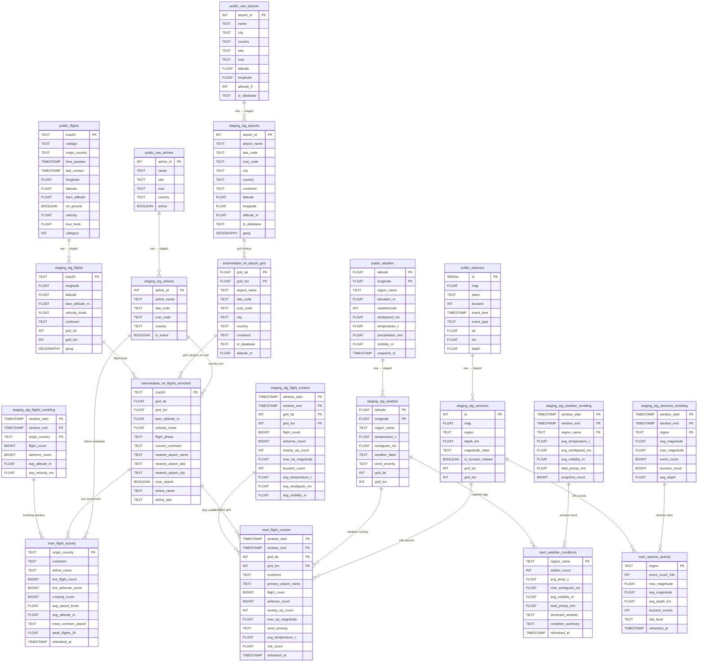

<p align="center">
    <h1> SkyPulse - Streaming Pipeline </h1>
</p>

<p align="center">
    
</p>

**Real-time ingestion, processing, and enrichment of global flight, weather, and seismic data — from raw API feeds to analytics-ready marts.**


---

## About the Project

SkyPulse is an end-to-end streaming data pipeline that continuously ingests three independent real-world data streams:

- **Flight positions** — live aircraft states from the [OpenSky Network](https://opensky-network.org/) REST API (ICAO 24-bit transponder data, ~90s polling cadence)
- **Weather snapshots** — current atmospheric conditions across a global grid of ~500+ points sourced from the [Open-Meteo](https://open-meteo.com/) API (15-min cadence)
- **Seismic events** — real-time earthquake feeds from the [USGS Earthquake Hazards Program](https://earthquake.usgs.gov/) (60s polling, event-time deduplication)

Each stream is independently produced into a Redpanda (Kafka-compatible) broker, consumed into a Supabase (PostgreSQL) landing zone, and processed by Apache Flink tumbling-window jobs that compute 5-minute aggregates. A Bruin pipeline then transforms raw landing tables into a layered analytical model (staging → intermediate → marts), producing enriched, cross-stream outputs including a composite geospatial risk score per 10-degree grid cell.

The combination of these three domains makes real-time enrichment genuinely meaningful: a grid cell with high air traffic, a nearby M6+ earthquake, and storm-level wind gusts tells a different operational story than any single stream in isolation.

---

## Objective

The project is designed around three technical goals:

**Scalability.** Producers, consumers, and Flink jobs run as independent processes with no shared state. Redpanda handles backpressure. Flink checkpointing (10s interval) ensures exactly-once semantics for the JDBC sinks. Batch sizes and flush intervals are tunable per consumer.

**Automation.** A `Makefile` orchestrates the full lifecycle: infrastructure provisioning, topic management, and launching all six streaming processes (3 producers + 3 consumers) plus four Flink jobs in a single `make streaming` target. A GitHub Actions CI pipeline enforces linting on every push to `develop` and `main`.

**Observability.** Structured logging is implemented across all producers, consumers, and Flink jobs. Flink's web UI (`:8081`) exposes job graphs, checkpoint metrics, and backpressure indicators. Bruin column-level checks and custom `row_count_positive` assertions validate data quality at every transformation layer.

---

## Tech Stack

| Category | Tools |
|---|---|
| **Language** | Python 3.12, SQL |
| **Dependency Management** | `uv` |
| **Streaming Broker** | Redpanda v25.3.9 (Kafka-compatible) |
| **Stream Processing** | Apache Flink 2.2.0 + PyFlink |
| **Landing & Serving DB** | Supabase (PostgreSQL 18 via `psycopg2`) |
| **Transformation Pipeline** | Bruin |
| **Containerization** | Docker, Docker Compose |
| **CI/CD** | GitHub Actions |
| **Linting** | Ruff, pre-commit |
| **Data Validation** | Bruin column checks + custom SQL assertions |
| **External APIs** | OpenSky Network, Open-Meteo, USGS Earthquake Feeds, OpenFlights (airports, airlines, planes) |

---

## Architecture

The pipeline is organized into four logical layers:

### 1. Ingestion (Producers)

Three independent Python producers run continuously and publish JSON-serialized messages to dedicated Redpanda topics:

| Producer | Topic | Source | Cadence |
|---|---|---|---|
| `flight_producer.py` | `flight-feeds` | OpenSky Network API (OAuth2) | 90s |
| `weather_producer.py` | `weather-feeds` | Open-Meteo API (~500 grid points) | 600s |
| `seismic_producer.py` | `earthquake-feeds` | USGS GeoJSON feeds | 60s |

Each producer uses a Pydantic-backed dataclass model (`Flight`, `Weather`, `Earthquake`) for parsing and serialization. The seismic producer implements state-based deduplication via a local JSON file (`state_seismic.json`) to avoid re-publishing events already seen in the USGS daily feed. The flight producer handles OAuth2 token refresh automatically, with rate-limit backoff on HTTP 429.

### 2. Landing (Consumers → Supabase `public` schema)

Three Kafka consumers write raw records to Supabase, one per topic:

| Consumer | Target Table | Strategy |
|---|---|---|
| `flight_consumer.py` | `public.flights` | Batch upsert (9,000 records), `ON CONFLICT (icao24) DO UPDATE` |
| `weather_consumer.py` | `public.weather` | Batch upsert (257 records), `ON CONFLICT (latitude, longitude) DO UPDATE` |
| `seismic_consumer.py` | `public.seismics` | Row-by-row insert (append-only) |

Flights and weather are upserted because they represent the latest known state of a moving object or grid point. Seismic events are append-only since each earthquake is a distinct occurrence.

A fourth static ingestion path uses Bruin Python assets to load reference data from [OpenFlights](https://openflights.org/) into `public.raw_airports`, `public.raw_airlines`, and `public.raw_planes`.

### 3. Processing (Apache Flink — tumbling window jobs)

Four PyFlink jobs run inside the Flink cluster (JobManager + TaskManager containers):

| Job | Input Topic(s) | Output Table | Window |
|---|---|---|---|
| `flight_tumbling.py` | `flight-feeds` | `flights_tumbling` | 5 min PROCTIME |
| `seismic_tumbling.py` | `earthquake-feeds` | `seismics_tumbling` | 5 min event time |
| `weather_tumbling.py` | `weather-feeds` | `weather_tumbling` | 5 min event time |
| `flight_context_tumbling.py` | all three topics | `flight_context` | 5 min PROCTIME |

`flight_context_tumbling.py` is the core cross-stream job. It joins flights, seismic events, and weather readings on a shared 10-degree lat/lon grid cell — a deliberately coarse spatial key that avoids a full cross-join while preserving geographic relevance. Watermarks are set at 30s for seismic (low-latency USGS feed) and 60s for weather (15-min update cycle).

All jobs write to Supabase via the Flink JDBC connector (`flink-connector-jdbc-postgres`) and enable checkpointing at 10s intervals.

### 4. Serving (Bruin pipeline — `staging` → `intermediate` → `mart`)

The Bruin pipeline (`pipeline.yml`, scheduled every 2 minutes) transforms landing tables into three analytical layers:

**Staging** — clean, typed, geo-enriched views of each raw table. Key transformations include: geospatial `geography` column creation via PostGIS (`ST_MakePoint`), continent classification, 10-degree grid cell assignment, WMO weather code labels, wind severity bands, and magnitude classification for seismic events.

**Intermediate** — pre-joined, performance-optimized tables. `int_airport_grid` builds a spatial lookup grid from `stg_airports`. `int_flights_enriched` joins live flights with the nearest airport (via grid cell) and infers flight phase (`on_ground`, `takeoff_landing`, `climbing_descending`, `cruising`) and airline from country of origin.

**Marts** — four analytics-ready tables:

- `mart.mart_flight_activity` — global flight counts by country and continent, enriched with airline metadata, flight phase breakdown, and a 2-hour trend window.
- `mart.mart_weather_conditions` — regional weather aggregates with condition summaries, wind alerts, and temperature trends from tumbling windows.
- `mart.mart_seismic_activity` — seismic statistics by region over 24h, including magnitude class distribution, risk level classification, and hourly event trends.
- `mart.mart_flight_context` — the cross-stream enrichment mart. One row per active 10-degree grid cell, combining Flink window aggregates (flights + seismic + weather) with live flight phase data and a composite **risk score (0–100)** calculated from airborne density, seismic magnitude, wind severity, and visibility.

---

## Database Entity Relationship

The diagram below shows the key tables across all layers, their primary keys, and how they relate through shared geographic identifiers (`grid_lat`, `grid_lon`) and reference joins.



---

## Project Tree

```text
SkyPulse-Streaming-Pipeline/
├── .github/
│   └── workflows/
│       └── ci.yml                        # Lint job (Ruff + pre-commit)
├── .pre-commit-config.yaml
├── .python-version                       # 3.12
├── Makefile                              # Full lifecycle automation
├── pyproject.toml                        # uv project + Ruff config
├── uv.lock
│
├── deploy/
│   ├── docker-compose.yml                # Redpanda, Postgres, Flink JobManager + TaskManager
│   ├── Dockerfile.flink                  # PyFlink 2.2 + JDBC/Kafka connectors
│   ├── flink-config.yaml                 # Flink cluster configuration
│   └── pyproject.flink.toml             # Flink-specific Python dependencies
│
├── src/
│   ├── logger.py                         # Shared structured logger
│   ├── models/
│   │   ├── flight.py                     # Flight dataclass + serializer/deserializer
│   │   ├── seismic.py                    # Earthquake dataclass + serializer/deserializer
│   │   └── weather.py                   # Weather dataclass + serializer/deserializer
│   ├── producers/
│   │   ├── flight_producer.py            # OpenSky Network → flight-feeds
│   │   ├── seismic_producer.py           # USGS GeoJSON → earthquake-feeds
│   │   ├── weather_producer.py           # Open-Meteo grid → weather-feeds
│   │   └── misc/
│   │       └── cache.sqlite              # requests-cache for Open-Meteo
│   ├── consumers/
│   │   ├── flight_consumer.py            # flight-feeds → public.flights
│   │   ├── seismic_consumer.py           # earthquake-feeds → public.seismics
│   │   └── weather_consumer.py          # weather-feeds → public.weather
│   └── jobs/
│       ├── flight_tumbling.py            # Flink: 5-min flight aggregation
│       ├── seismic_tumbling.py           # Flink: 5-min seismic aggregation
│       ├── weather_tumbling.py           # Flink: 5-min weather aggregation
│       └── flight_context_tumbling.py   # Flink: cross-stream join + grid output
│
├── pipeline/
│   ├── pipeline.yml                      # Bruin pipeline definition (every 2 min)
│   └── assets/
│       ├── ingestion/
│       │   ├── ingest_airlines.py        # OpenFlights → public.raw_airlines
│       │   ├── ingest_airports.py        # OpenFlights → public.raw_airports
│       │   ├── ingest_planes.py          # OpenFlights → public.raw_planes
│       │   ├── ingest_routes.py          # OpenFlights → public.raw_routes
│       │   └── requirements.txt
│       ├── staging/
│       │   ├── stg_flights.sql
│       │   ├── stg_weather.sql
│       │   ├── stg_seismics.sql
│       │   ├── stg_airports.sql
│       │   ├── stg_airlines.sql
│       │   ├── stg_routes.sql
│       │   ├── stg_flights_tumbling.sql
│       │   ├── stg_seismics_tumbling.sql
│       │   └── stg_weather_tumbling.sql
│       ├── intermediate/
│       │   ├── int_airport_grid.sql
│       │   └── int_flights_enriched.sql
│       └── marts/
│           ├── mart_flight_activity.sql
│           ├── mart_weather_conditions.sql
│           ├── mart_seismic_activity.sql
│           └── mart_flight_context.sql
│
├── scripts/
│   ├── bruin/
│   │   ├── run_bruin.bat
│   │   ├── test_bruin.bat
│   │   └── validate_bruin.bat
│   ├── tree.py
│   └── wait_topics.py                   # Polls Redpanda until topics are ready
│
└── notebooks/
    ├── flights_producer.ipynb
    ├── flights_consumer.ipynb
    ├── seismic_producer.ipynb
    ├── seismic_consumer.ipynb
    ├── weather_producer.ipynb
    └── weather_consumer.ipynb
```

---

## Getting Started

### Prerequisites

| Tool | Version | Notes |
|---|---|---|
| Python | 3.12 | Managed via `.python-version` |
| `uv` | latest | [Install](https://docs.astral.sh/uv/getting-started/installation/) |
| Docker + Docker Compose | latest | Required for Redpanda and Flink |
| Bruin CLI | latest | [Install](https://bruin-data.github.io/bruin/getting-started/introduction.html) |
| Supabase project | — | Free tier is sufficient |

### Environment Setup

Copy and populate the `.env` file at the project root:

```bash
cp .env.example .env
```

Required variables:

```dotenv
# Redpanda
KAFKA_BOOTSTRAP_SERVERS=localhost:9092

# Redpanda topic names
TOPIC_FLIGHTS=flight-feeds
TOPIC_SEISMIC=earthquake-feeds
TOPIC_WEATHER=weather-feeds

# Supabase (PostgreSQL)
SUPABASE_HOST=<your-supabase-host>
SUPABASE_PORT=5432
SUPABASE_USER=postgres
SUPABASE_PASSWORD=<your-password>
SUPABASE_DATABASE=postgres

# OpenSky Network (OAuth2)
OPENSKY_CLIENT_ID=<your-client-id>
OPENSKY_CLIENT_SECRET=<your-client-secret>
```

Install Python dependencies:

```bash
make install
```

### Supabase Schema Setup

Before running any consumer or Flink job, create the required tables in Supabase. The DDL statements are embedded as comments at the top of each consumer and Flink job file. The minimal set for a full run:

```sql
-- Landing tables
CREATE TABLE flights ( icao24 TEXT PRIMARY KEY, callsign TEXT, origin_country TEXT,
    time_position TIMESTAMP, last_contact TIMESTAMP, longitude DOUBLE PRECISION,
    latitude DOUBLE PRECISION, baro_altitude DOUBLE PRECISION, on_ground BOOLEAN,
    velocity DOUBLE PRECISION, true_track DOUBLE PRECISION, category INTEGER );

CREATE TABLE seismics ( id SERIAL PRIMARY KEY, mag DOUBLE PRECISION, mag_type TEXT,
    place TEXT, tsunami INTEGER, event_time TIMESTAMP, event_type TEXT, title TEXT,
    sig INTEGER, lat DOUBLE PRECISION, lon DOUBLE PRECISION, depth DOUBLE PRECISION );

CREATE TABLE weather ( latitude DOUBLE PRECISION, longitude DOUBLE PRECISION,
    region_name TEXT, elevation_m DOUBLE PRECISION, weathercode INTEGER,
    interval_s INTEGER, windspeed_ms DOUBLE PRECISION, winddirection_deg DOUBLE PRECISION,
    windgusts_ms DOUBLE PRECISION, precipitation_mm DOUBLE PRECISION, rain_mm DOUBLE PRECISION,
    snowfall_cm DOUBLE PRECISION, showers_mm DOUBLE PRECISION, snow_depth_m DOUBLE PRECISION,
    cloudcover_pct DOUBLE PRECISION, cloudcover_low_pct DOUBLE PRECISION,
    temperature_c DOUBLE PRECISION, apparent_temperature_c DOUBLE PRECISION,
    humidity_pct DOUBLE PRECISION, visibility_m DOUBLE PRECISION,
    pressure_hpa DOUBLE PRECISION, snapshot_ts TIMESTAMP,
    PRIMARY KEY (latitude, longitude) );

-- Flink tumbling window output tables
CREATE TABLE flights_tumbling ( window_start TIMESTAMP, window_end TIMESTAMP,
    origin_country TEXT, flight_count BIGINT, airborne_count BIGINT,
    avg_altitude_m DOUBLE PRECISION, avg_velocity_ms DOUBLE PRECISION,
    PRIMARY KEY (window_start, window_end, origin_country) );

CREATE TABLE seismics_tumbling ( window_start TIMESTAMP, window_end TIMESTAMP,
    region TEXT, avg_magnitude DOUBLE PRECISION, max_magnitude DOUBLE PRECISION,
    event_count BIGINT, tsunami_count BIGINT, avg_depth DOUBLE PRECISION,
    PRIMARY KEY (window_start, window_end, region) );

CREATE TABLE weather_tumbling ( window_start TIMESTAMP, window_end TIMESTAMP,
    region_name TEXT, avg_temperature_c DOUBLE PRECISION, min_temperature_c DOUBLE PRECISION,
    max_temperature_c DOUBLE PRECISION, avg_windspeed_ms DOUBLE PRECISION,
    avg_windgusts_ms DOUBLE PRECISION, avg_visibility_m DOUBLE PRECISION,
    avg_humidity_pct DOUBLE PRECISION, total_precip_mm DOUBLE PRECISION,
    snapshot_count BIGINT, PRIMARY KEY (window_start, window_end, region_name) );
```

Enable the PostGIS extension (required by staging SQL assets):

```sql
CREATE EXTENSION IF NOT EXISTS postgis;
```

### Start the Infrastructure

Build and start Redpanda and the Flink cluster:

```bash
make deploy
```

This brings up three containers: `redpanda`, `jobmanager` (Flink UI at `http://localhost:8081`), and `taskmanager`.

Create Redpanda topics (or reset existing ones):

```bash
make clean-topics
```

### Run the Streaming Pipeline

Start all producers, consumers, and Flink jobs in one command:

```bash
make streaming
```

This executes the following steps in sequence:

1. `make producers` — launches `seismic_producer.py`, `flight_producer.py`, and `weather_producer.py` in separate terminal windows
2. `make consumers` — launches `seismic_consumer.py`, `flight_consumer.py`, and `weather_consumer.py` in separate terminal windows
3. `make wait-topics` — polls Redpanda until all three topics have received at least one message
4. `make jobs` — submits all four Flink jobs to the JobManager via `docker exec`

To run components individually:

```bash
make producers     # producers only
make consumers     # consumers only
make jobs          # Flink jobs only (requires topics to have data)
```

### Run the Bruin Transformation Pipeline

With data in the landing tables, run the full Bruin pipeline:

```bash
# Windows
scripts\bruin\run_bruin.bat

# Validate assets without executing
scripts\bruin\validate_bruin.bat

# Run tests (column checks + custom assertions)
scripts\bruin\test_bruin.bat
```

The pipeline processes assets in dependency order: `ingestion` → `staging` → `intermediate` → `marts`.

### Teardown

```bash
make deploy-destroy    # Stop and remove Flink + Redpanda containers
make postgres-destroy  # Stop and remove the local Postgres container (if used)
```

---

## License

Distributed under the MIT License. See `LICENSE` for details.
