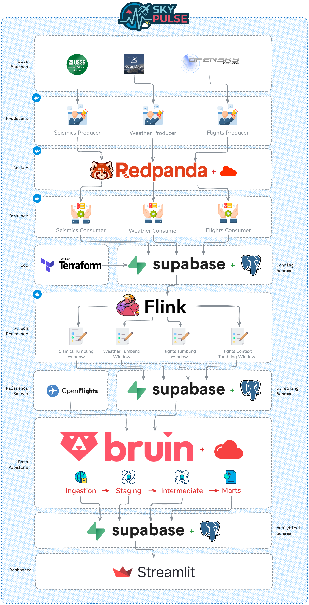
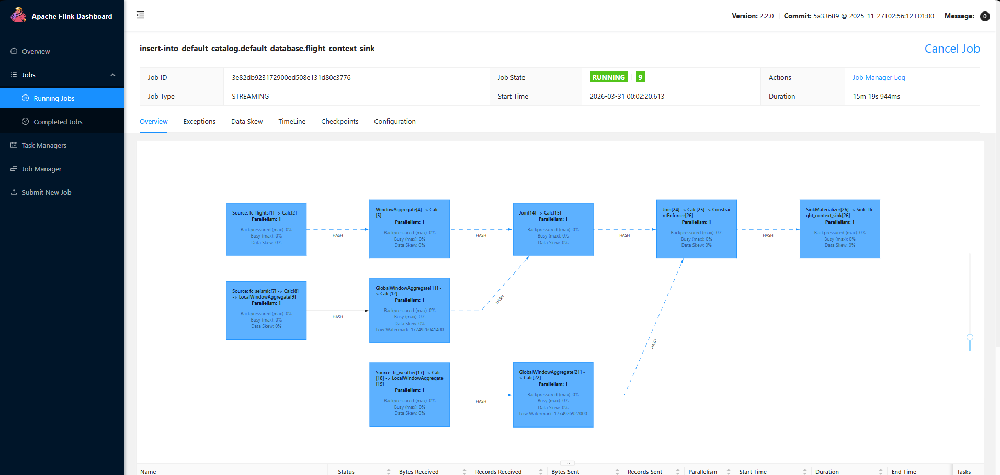
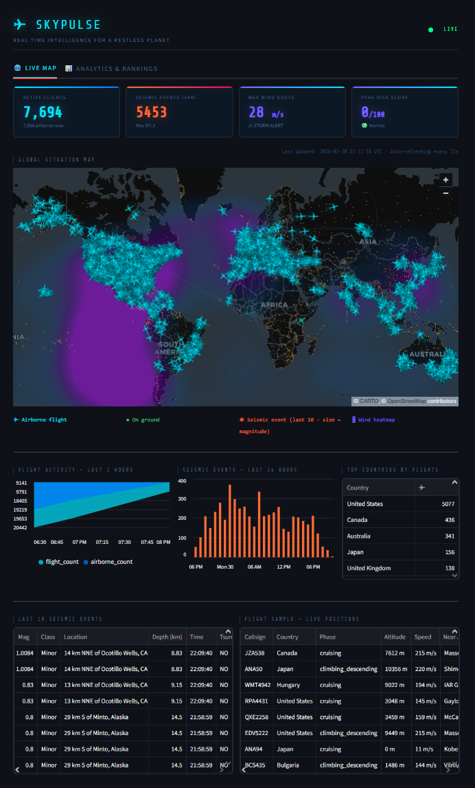
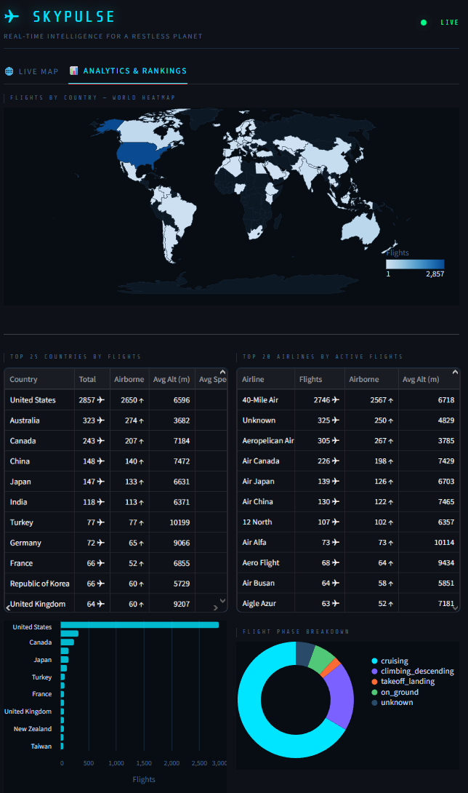
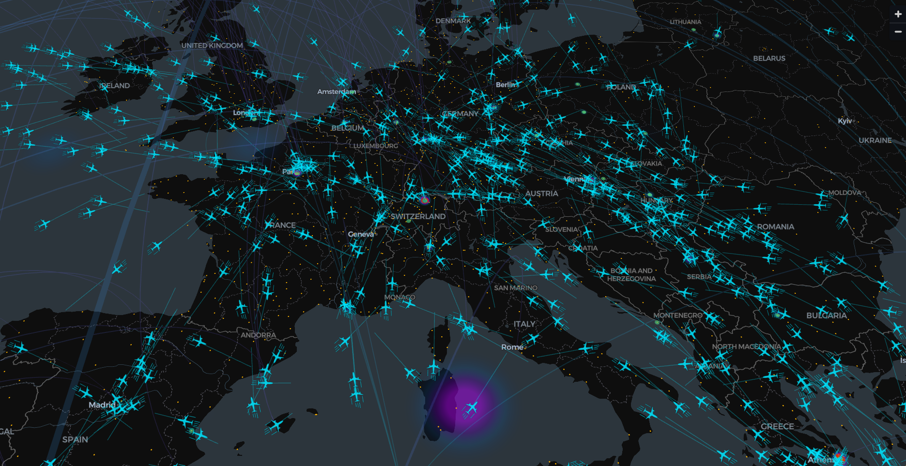
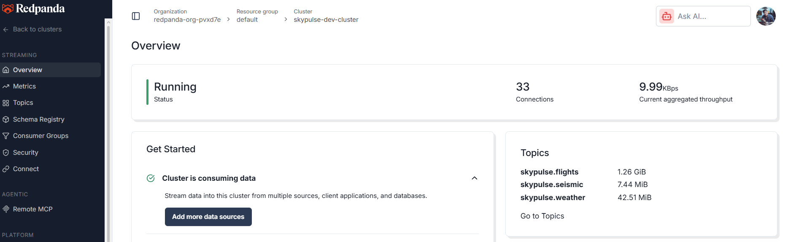
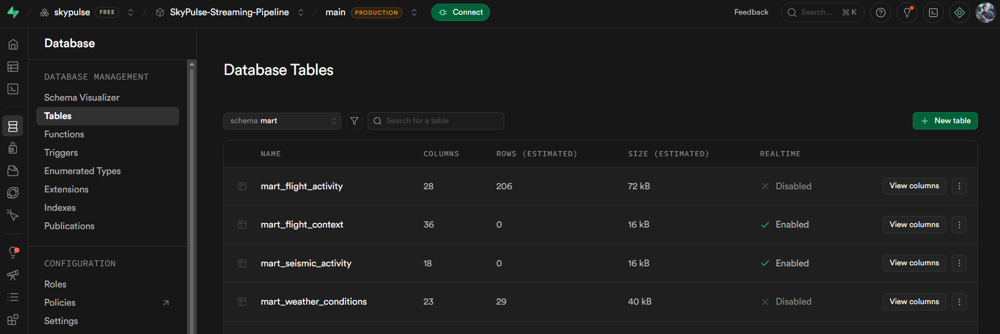
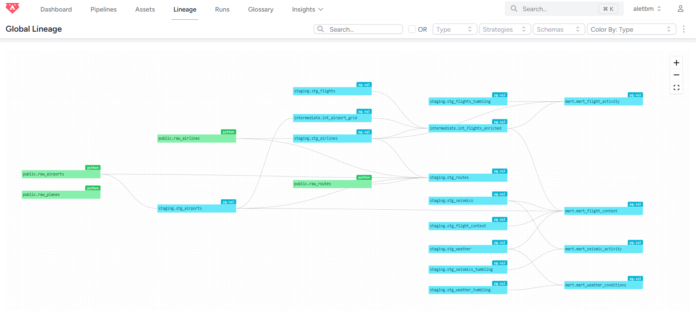
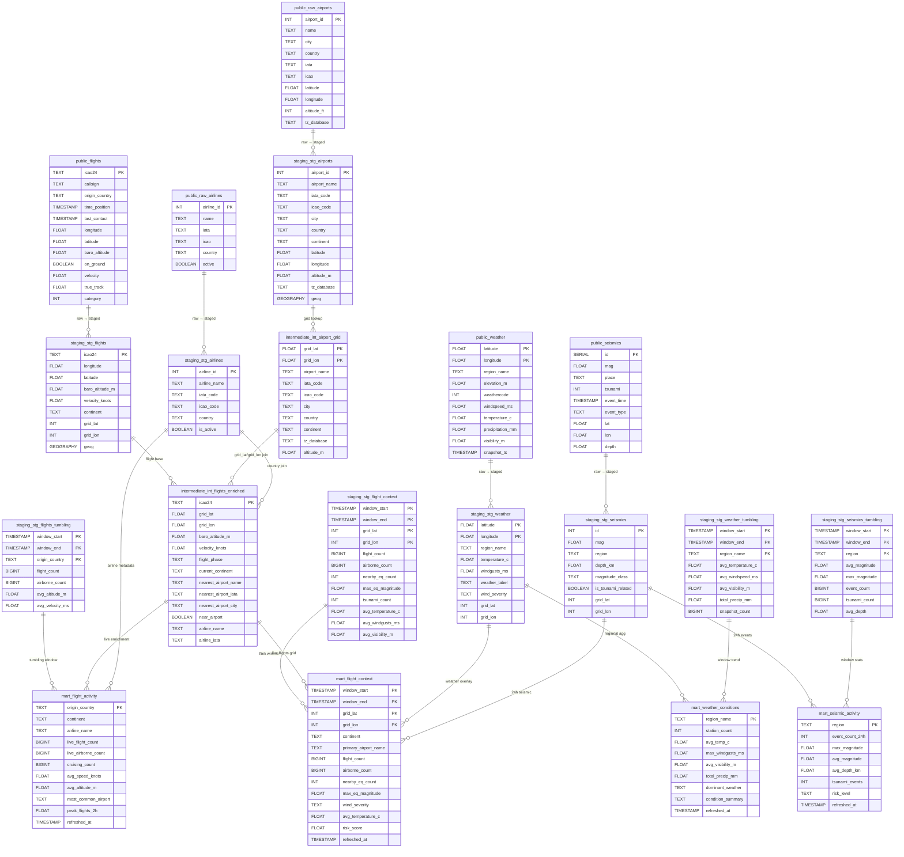

<div align="center">
    
    <h1> SkyPulse - Streaming Pipeline </h1>
    <strong>Real-time ingestion, processing, and enrichment of global flight, weather, and seismic data — from raw API feeds to an interactive cloud dashboard.</strong>
    <br>
    <br>
    
    
    
    
    
    
    
    
    
    
    
    
    
    
    
    
</div>

---

## 🌐 Project Links

| Resource | URL |
|---|---|
| **Live Dashboard** | *[Streamlit Cloud](https://skypulse-streaming-pipeline.streamlit.app)* |

---

## 💡 About the Project

No single API provides a cross-domain view of global airspace. Fusing flight transponder feeds, atmospheric sensors, and seismic networks — each with different polling frequencies and update semantics — requires more than periodic batch pulls. The real challenge is making the data **useful together in near real-time**: a grid cell with 40 active aircraft, a M5.8 earthquake 200km away, and storm-level wind gusts tells a different operational story than any individual stream alone.

SkyPulse is an end-to-end streaming data pipeline that continuously ingests three independent real-world data streams:

- **Flight positions** — live aircraft states from the [OpenSky Network](https://opensky-network.org/) REST API (ICAO 24-bit transponder data, ~90s polling cadence)
- **Weather snapshots** — current atmospheric conditions across a global grid of ~500+ points sourced from the [Open-Meteo](https://open-meteo.com/) API (15-min cadence)
- **Seismic events** — real-time earthquake feeds from the [USGS Earthquake Hazards Program](https://earthquake.usgs.gov/) (60s polling, event-time deduplication)

Each stream is independently produced into a Redpanda Cloud (Kafka-compatible) broker, consumed into a Supabase (PostgreSQL) landing zone, and processed by Apache Flink tumbling-window jobs that compute 5-minute aggregates. A Bruin pipeline running in Bruin Cloud then transforms raw landing tables into a layered analytical model (staging → intermediate → marts), producing enriched, cross-stream outputs including a composite geospatial risk score per 10-degree grid cell. A Streamlit dashboard deployed to Streamlit Cloud visualizes all streams live.

---

## Objective

The project is designed around three technical goals:

**Scalability.** Producers, consumers, and Flink jobs run as independent containerized processes with no shared state. Redpanda Cloud handles backpressure. Flink checkpointing (10s interval) ensures exactly-once semantics for the JDBC sinks. Batch sizes and flush intervals are tunable per consumer.

**Automation.** A `Makefile` orchestrates the full lifecycle: infrastructure provisioning, Docker builds for producers and consumers, topic management, and launching all streaming processes plus four Flink jobs. A GitHub Actions CI pipeline enforces linting on every push to `develop` and `main`.

**Observability.** Structured logging is implemented across all producers, consumers, and Flink jobs. Flink's web UI (`:8081`) exposes job graphs, checkpoint metrics, and backpressure indicators. Bruin column-level checks and custom `row_count_positive` assertions validate data quality at every transformation layer.

---

## Tech Stack

| Category | Tools |
|---|---|
| **Language** | Python 3.12, SQL |
| **Dependency Management** | `uv` |
| **Streaming Broker** | Redpanda Cloud (Kafka-compatible) |
| **Stream Processing** | Apache Flink 2.2.0 + PyFlink |
| **Landing & Serving DB** | Supabase (PostgreSQL 18 via `psycopg2`) |
| **Transformation Pipeline** | Bruin (running in Bruin Cloud) |
| **Dashboard** | Streamlit (deployed to Streamlit Cloud) |
| **Infrastructure as Code** | Terraform (`supabase/supabase` provider) |
| **Containerization** | Docker, Docker Compose (producers & consumers) |
| **CI/CD** | GitHub Actions |
| **Linting** | Ruff, pre-commit |
| **Data Validation** | Bruin column checks + custom SQL assertions |
| **External APIs** | OpenSky Network (OAuth2), Open-Meteo, USGS Earthquake Feeds, OpenFlights (airports, airlines, planes) |

---

## Architecture



> The diagram above shows the full data flow from source APIs through the broker, landing zone, stream processing, transformation, and dashboard layers. Generated from the Mermaid source below.

The pipeline is organized into five logical layers:

### 0. Infrastructure as Code (Terraform + Migrations)

Before any data flows, the entire Supabase cloud environment is provisioned and configured declaratively from `infra/`:

```
infra/
├── setup.bat                  # One-command provisioning entrypoint (Windows/WSL)
├── setup.sh                   # One-command provisioning entrypoint (Linux/macOS)
├── migrations/
│   └── migrate.py             # DDL + RLS + Realtime + .env patcher
└── terraform/
    ├── provider.tf            # supabase/supabase provider (~> 1.0)
    ├── project.tf             # supabase_project resource
    ├── settings.tf            # PostgREST schema exposure
    ├── variables.tf           # access_token, org_id, region, db_password
    └── outputs.tf             # project_ref, project_url → consumed by migrate.py
```

**Terraform** creates the Supabase project and exposes the `public`, `staging`, `intermediate`, and `mart` schemas through PostgREST. **`migrate.py`** reads those Terraform outputs and sequentially waits for the DB to boot, runs DDL migrations (PostGIS, schemas, tables, indexes), configures RLS on all 26 tables, enables Supabase Realtime, and patches `.env` with the generated credentials — all triggered by a single `make infra-deploy` command.

> **OS support:** `infra/setup.bat` is the provisioning entrypoint for Windows/WSL. `infra/setup.sh` is provided for Linux and macOS users.

### 1. Ingestion (Producers — Containerized)

Three independent Python producers run continuously in Docker containers and publish JSON-serialized messages to dedicated Redpanda Cloud topics:

| Producer | Topic | Source | Cadence |
|---|---|---|---|
| `flight_producer.py` | `skypulse.flights` | OpenSky Network API (OAuth2) | 90s |
| `weather_producer.py` | `skypulse.weather` | Open-Meteo API (~500 grid points) | 600s |
| `seismic_producer.py` | `skypulse.seismic` | USGS GeoJSON feeds | 60s |

> Each producer uses a Pydantic-backed model for parsing and serialization.
> The seismic producer deduplicates events via a local state file.
> The flight producer handles OAuth2 token refresh automatically with rate-limit backoff.
> All producers authenticate to Redpanda Cloud via SASL/SCRAM.


### 2. Landing (Consumers → Supabase `public` schema — Containerized)

Three Kafka consumers run in Docker containers and write raw records to Supabase, one per topic:

| Consumer | Target Table | Strategy |
|---|---|---|
| `flight_consumer.py` | `public.flights` | Batch upsert (~9,000 records), `ON CONFLICT (icao24) DO UPDATE` |
| `weather_consumer.py` | `public.weather` | Batch upsert (~257 records), `ON CONFLICT (latitude, longitude) DO UPDATE` |
| `seismic_consumer.py` | `public.seismics` | Row-by-row insert (append-only) |

Flights and weather are upserted (latest known state); seismic events are append-only (each earthquake is a distinct occurrence).


**Static reference ingestion via Bruin.** Four Bruin Python assets fetch CSV data from [OpenFlights](https://openflights.org/) and materialize it as tables in Supabase:

| Bruin Asset | Target Table | Records |
|---|---|---|
| `ingest_airports.py` | `public.raw_airports` | ~7,700 airports |
| `ingest_airlines.py` | `public.raw_airlines` | ~5,800 airlines |
| `ingest_planes.py` | `public.raw_planes` | ~200 aircraft types |
| `ingest_routes.py` | `public.raw_routes` | ~67,000 routes |

These tables feed the staging layer and power airport proximity enrichment and airline attribution in the intermediate and mart layers.

### 3. Processing (Apache Flink — Tumbling Window Jobs)

Four PyFlink jobs run inside the Flink cluster (JobManager + TaskManager containers):

| Job | Input Topic(s) | Output Table | Window |
|---|---|---|---|
| `flight_tumbling.py` | `skypulse.flights` | `flights_tumbling` | 5 min PROCTIME |
| `seismic_tumbling.py` | `skypulse.seismic` | `seismics_tumbling` | 5 min event time |
| `weather_tumbling.py` | `skypulse.weather` | `weather_tumbling` | 5 min event time |
| `flight_context_tumbling.py` | all three topics | `flight_context` | 5 min PROCTIME |

`flight_context_tumbling.py` is the core cross-stream job. It joins flights, seismic events, and weather readings on a shared 10-degree lat/lon grid cell — a deliberately coarse spatial key that avoids a full cross-join while preserving geographic relevance. Watermarks are set at 30s for seismic (low-latency USGS feed) and 60s for weather (15-min update cycle).

All jobs write to Supabase via the Flink JDBC connector (`flink-connector-jdbc-postgres`) and enable checkpointing at 10s intervals.



### 4. Serving (Bruin Cloud Pipeline — `staging` → `intermediate` → `mart`)

The Bruin pipeline (`pipeline.yml`, running in Bruin Cloud, scheduled every 2 minutes) transforms landing tables into three analytical layers:

**Staging** — clean, typed, geo-enriched views of each raw table: PostGIS `geography` columns, continent classification, 10-degree grid cell assignment, WMO weather labels, wind severity bands, and seismic magnitude classification.

**Intermediate** — pre-joined tables. `int_airport_grid` builds a spatial lookup grid from `stg_airports`. `int_flights_enriched` joins live flights with the nearest airport and infers flight phase and airline.

**Marts** — four analytics-ready tables:

- `mart_flight_activity` — global flight counts by country and continent, enriched with airline metadata and a 2-hour trend window.
- `mart_weather_conditions` — regional weather aggregates with condition summaries, wind alerts, and temperature trends.
- `mart_seismic_activity` — seismic statistics by region over 24h, including magnitude distribution and risk classification.
- `mart_flight_context` — the core cross-stream mart. One row per active 10-degree grid cell, combining Flink window aggregates with live flight phase data and a composite **risk score (0–100)** from airborne density, seismic magnitude, wind severity, and visibility.

### 5. Dashboard (Streamlit Cloud)

A Streamlit app (`app/`) deployed to Streamlit Cloud connects directly to Supabase via `psycopg2` and renders the full analytical output in an interactive interface. Key views include:

- **Global flight map** — live aircraft positions with altitude, velocity, and flight phase overlays (via PyDeck)
- **Risk score heatmap** — composite 0–100 risk score per grid cell combining air traffic density, seismic activity, and weather severity
- **Weather dashboard** — regional weather conditions, wind severity alerts, and precipitation totals
- **Seismic activity** — real-time earthquake feed with magnitude classification, depth, and tsunami flags
- **Time-series charts** — 5-minute tumbling window aggregates per region (via Altair)





---

## Cloud Infrastructure

### Redpanda Cloud

Topics are hosted in Redpanda Cloud (Kafka-compatible, fully managed). The three topics used are:

| Topic | Description |
|---|---|
| `skypulse.flights` | Live aircraft transponder states |
| `skypulse.seismic` | USGS earthquake events |
| `skypulse.weather` | Open-Meteo grid snapshots |

Authentication uses SASL/SCRAM over TLS. Producers and consumers connect using `REDPANDA_SERVER`, `REDPANDA_USERNAME`, and `REDPANDA_PASSWORD` from the environment.



### Supabase

The Supabase project is fully provisioned via Terraform and migrated via `migrate.py`. It hosts all four schema layers, PostGIS extensions, Row Level Security, and Supabase Realtime for live push to the dashboard.



### Bruin Cloud

The Bruin pipeline (`pipeline/`) runs on Bruin Cloud on a 2-minute schedule. It handles static reference data ingestion from OpenFlights, SQL transformations across all four schema layers, and column-level quality checks at every step. No local orchestrator is needed — once the pipeline directory is pushed and the Supabase connection is configured, Bruin Cloud runs autonomously.



---

## Data Warehouse Design & Optimization

### Why Supabase (PostgreSQL) instead of BigQuery or Snowflake

SkyPulse is a **real-time upsert-heavy pipeline**, which makes columnar cloud DWHs a poor fit for the landing layer. BigQuery Streaming Inserts don't support `ON CONFLICT ... DO UPDATE`, requiring expensive merge jobs or accumulating duplicates. Snowflake and Redshift face the same constraint with high-cadence `MERGE` statements.

Supabase (PostgreSQL) supports native `INSERT ... ON CONFLICT DO UPDATE` with row-level granularity, no per-row cost, and PostGIS for geospatial operations — all essential for continuously updating ~9,000 live aircraft states every 90 seconds.

### Partitioning & Clustering Equivalent in PostgreSQL

PostgreSQL achieves equivalent performance to BigQuery partitioning/clustering through **partial indexes**, **expression indexes**, **GiST indexes**, and **composite primary keys**.

#### Landing tables — primary key as clustering key

| Table | PK / Unique Key | Query pattern optimized |
|---|---|---|
| `public.flights` | `icao24` | Upsert by transponder ID; point lookup by aircraft |
| `public.weather` | `(latitude, longitude)` | Upsert by grid point; range scan by region |
| `public.seismics` | `id` (serial) | Append-only; range scan by `event_time` |
| `public.flights_tumbling` | `(window_start, window_end, origin_country)` | Window range + country filter |
| `public.seismics_tumbling` | `(window_start, window_end, region)` | Window range + region filter |
| `public.weather_tumbling` | `(window_start, window_end, region_name)` | Window range + region filter |
| `public.flight_context` | `(window_start, window_end, grid_lat, grid_lon)` | Window range + spatial grid filter |

#### Key indexes

**`idx_stg_airports_geog`** (GiST) — enables PostGIS `ST_DWithin` nearest-airport lookups in `int_flights_enriched`, pruning the search space to a bounding box instead of scanning all ~7,700 airports.

**`idx_airport_grid_lookup`** (B-tree on `grid_lat, grid_lon`) — makes each 10-degree grid cell lookup O(1) across the ~500-row airport grid table.

**`idx_stg_flights_grid_computed`** (expression index on `FLOOR(lat*2)/2, FLOOR(lon*2)/2`) — matches the computed join key in `int_flights_enriched` exactly, avoiding a full sequential scan on every mart refresh.

**`idx_stg_airlines_country`** (partial B-tree, `WHERE is_active = TRUE`) — filters out ~40% of inactive carriers at index build time, equivalent to a BigQuery clustered column with a pushed-down filter.

Additional point-lookup indexes on `iata_code` and `icao_code` for airports and airlines support dashboard-level code resolution joins.

---

## Database Entity Relationship

The diagram below shows the key tables across all layers, their primary keys, and how they relate through shared geographic identifiers (`grid_lat`, `grid_lon`) and reference joins.



---

## Project Tree

```text
SkyPulse-Streaming-Pipeline/
├── .github/
│   └── workflows/
│       └── ci.yml                        # Lint job (Ruff + pre-commit)
├── .pre-commit-config.yaml
├── .python-version                       # 3.12
├── Makefile                              # Full lifecycle automation
├── pyproject.toml                        # uv project + Ruff config
├── uv.lock
│
├── app/                                  # Streamlit Cloud dashboard
│   ├── app.py                            # Main Streamlit application
│   ├── config.py                         # App configuration & constants
│   ├── config.toml                       # Streamlit theme configuration
│   ├── database.py                       # Supabase connection helpers
│   ├── fetchers.py                       # Data fetchers for each mart/layer
│   ├── map_layers.py                     # PyDeck map layer builders
│   └── requirements.txt                  # Streamlit Cloud dependencies
│
├── assets/
│   └── images/
│       ├── aircraft.png
│       └── skypulse_logo.svg
│
├── infra/
│   ├── .gitignore                        # Excludes .tfvars, .terraform/, state files
│   ├── setup.bat                         # One-command provisioning (Windows/WSL)
│   ├── setup.sh                          # One-command provisioning (Linux/macOS)
│   ├── migrations/
│   │   └── migrate.py                    # DDL + RLS + Realtime + .env patcher
│   └── terraform/
│       ├── .terraform.lock.hcl
│       ├── provider.tf                   # supabase/supabase provider ~> 1.0
│       ├── project.tf                    # supabase_project resource
│       ├── settings.tf                   # PostgREST API schema exposure
│       ├── variables.tf                  # access_token, org_id, region, db_password
│       └── outputs.tf                    # project_ref, project_url (consumed by migrate.py)
│
├── deploy/
│   ├── docker-compose.yml                # Redpanda (local), Postgres (local), Flink cluster
│   ├── docker-compose.flink.yml          # Standalone Flink compose (alternative)
│   ├── Dockerfile.flink                  # PyFlink 2.2 + JDBC/Kafka connectors
│   ├── flink-config.yaml                 # Flink cluster configuration
│   └── pyproject.flink.toml             # Flink-specific Python dependencies
│
├── src/
│   ├── Dockerfile.producers              # Container image for all three producers
│   ├── Dockerfile.consumers              # Container image for all three consumers
│   ├── logger.py                         # Shared structured logger
│   ├── models/
│   │   ├── flight.py                     # Flight dataclass + serializer/deserializer
│   │   ├── seismic.py                    # Earthquake dataclass + serializer/deserializer
│   │   └── weather.py                    # Weather dataclass + serializer/deserializer
│   ├── producers/
│   │   ├── flight_producer.py            # OpenSky Network → skypulse.flights
│   │   ├── seismic_producer.py           # USGS GeoJSON → skypulse.seismic
│   │   ├── weather_producer.py           # Open-Meteo grid → skypulse.weather
│   │   └── misc/
│   │       └── cache.sqlite              # requests-cache for Open-Meteo
│   ├── consumers/
│   │   ├── flight_consumer.py            # skypulse.flights → public.flights
│   │   ├── seismic_consumer.py           # skypulse.seismic → public.seismics
│   │   └── weather_consumer.py           # skypulse.weather → public.weather
│   └── jobs/
│       ├── flight_tumbling.py            # Flink: 5-min flight aggregation
│       ├── seismic_tumbling.py           # Flink: 5-min seismic aggregation
│       ├── weather_tumbling.py           # Flink: 5-min weather aggregation
│       └── flight_context_tumbling.py    # Flink: cross-stream join + grid output
│
├── pipeline/
│   ├── pipeline.yml                      # Bruin pipeline definition (every 2 min)
│   └── assets/
│       ├── ingestion/
│       │   ├── ingest_airlines.py        # OpenFlights → public.raw_airlines
│       │   ├── ingest_airports.py        # OpenFlights → public.raw_airports
│       │   ├── ingest_planes.py          # OpenFlights → public.raw_planes
│       │   ├── ingest_routes.py          # OpenFlights → public.raw_routes
│       │   └── requirements.txt
│       ├── staging/
│       │   ├── stg_flights.sql
│       │   ├── stg_weather.sql
│       │   ├── stg_seismics.sql
│       │   ├── stg_airports.sql
│       │   ├── stg_airlines.sql
│       │   ├── stg_routes.sql
│       │   ├── stg_flights_tumbling.sql
│       │   ├── stg_seismics_tumbling.sql
│       │   └── stg_weather_tumbling.sql
│       ├── intermediate/
│       │   ├── int_airport_grid.sql
│       │   └── int_flights_enriched.sql
│       └── marts/
│           ├── mart_flight_activity.sql
│           ├── mart_weather_conditions.sql
│           ├── mart_seismic_activity.sql
│           └── mart_flight_context.sql
│
├── scripts/
│   ├── bruin/
│   │   ├── run_bruin.bat
│   │   ├── test_bruin.bat
│   │   └── validate_bruin.bat
│   ├── tree.py
│   └── wait_topics.py                    # Polls Redpanda until topics are ready
│
└── notebooks/
    ├── flights_producer.ipynb
    ├── flights_consumer.ipynb
    ├── seismic_producer.ipynb
    ├── seismic_consumer.ipynb
    ├── weather_producer.ipynb
    └── weather_consumer.ipynb
```

---

## Getting Started

There are two ways to run SkyPulse: **fully local** (Flink + Redpanda in Docker, Bruin CLI, Streamlit local server) or **fully cloud** (Redpanda Cloud + Bruin Cloud + Streamlit Cloud). Both modes share the same Supabase infrastructure provisioned via Terraform.

---

### Prerequisites

| Tool | Version | Notes |
|---|---|---|
| Python | 3.12 | Managed via `.python-version` |
| `uv` | latest | [Install](https://docs.astral.sh/uv/getting-started/installation/) |
| `make` | latest | See note below |
| Docker + Docker Compose | latest | Required for Flink cluster and containerized producers/consumers |
| Terraform | >= 1.6 | [Install](https://developer.hashicorp.com/terraform/install) — required for `make infra-deploy` |
| Bruin CLI | latest | [Install](https://bruin-data.github.io/bruin/getting-started/introduction.html) — local mode only; cloud mode uses Bruin Cloud |
| Supabase account | — | Free tier sufficient — access token needed for Terraform |
| Redpanda Cloud account | — | Required for cloud mode; free tier sufficient |

> **Installing `make`**
>
> - **Linux (Debian/Ubuntu):** `sudo apt install make`
> - **macOS:** included with Xcode Command Line Tools — run `xcode-select --install`, or via Homebrew: `brew install make`
> - **Windows:** install via [Chocolatey](https://chocolatey.org/) with `choco install make`, or use [GnuWin32](https://gnuwin32.sourceforge.net/packages/make.htm). WSL2 is also a clean alternative — `make` works out of the box inside the Linux subsystem.

---

### Environment Setup

Copy and populate the `.env` file at the project root:

```bash
cp .env.example .env
```

Required variables:

```dotenv
# Redpanda Cloud (or local broker — see mode-specific notes below)
REDPANDA_SERVER=<your_redpanda_server>:9092          # e.g. seed-xxxx.xxx.redpanda.cloud:9092
REDPANDA_USERNAME=<your_redpanda_username>
REDPANDA_PASSWORD=<your_redpanda_password>

# Redpanda topic names
TOPIC_FLIGHTS=skypulse.flights
TOPIC_SEISMIC=skypulse.seismic
TOPIC_WEATHER=skypulse.weather

# OpenSky Network (OAuth2)
OPENSKY_CLIENT_ID=<your_opensky_client_id>
OPENSKY_CLIENT_SECRET=<your_opensky_client_secret>
USE_AUTH=true             # set to false to use the unauthenticated public API

# Supabase (PostgreSQL) — auto-populated by make infra-deploy
SUPABASE_HOST=<your_supabase_host>
SUPABASE_PORT=5432
SUPABASE_USER=<your_supabase_user>
SUPABASE_PASSWORD=<your_supabase_password>
SUPABASE_DATABASE=postgres
```

> **`SUPABASE_*` variables** are automatically written to `.env` by `migrate.py` at the end of `make infra-deploy`. You only need to fill them manually if you skip Terraform and point to a pre-existing Supabase project.
>
> **`USE_AUTH`** — set to `false` to use the OpenSky anonymous endpoint (rate-limited). Set to `true` to enable OAuth2 authentication with `OPENSKY_CLIENT_ID` + `OPENSKY_CLIENT_SECRET` for higher rate limits.

Install Python dependencies:

```bash
make install
```

---

### Provision Supabase Infrastructure (both modes)

Regardless of whether you run locally or in the cloud, the Supabase database must be provisioned first:

```bash
make infra-deploy
```

This runs `infra/setup.bat`, which executes `terraform init → validate → plan → apply` to provision the Supabase project, then `migrate.py` to run DDL migrations, enable PostGIS, configure RLS on all 26 tables, enable Supabase Realtime, and patch `.env` with the generated credentials automatically.

**Terraform variables** — create `infra/terraform/terraform.tfvars` (gitignored):

```hcl
supabase_access_token = "<your-supabase-access-token>"
org_id                = "<your-supabase-org-slug>"
supabase_region       = "us-east-1"
db_password           = "<a-strong-password>"
```

Your access token is at [supabase.com/dashboard/account/tokens](https://supabase.com/dashboard/account/tokens).

> **Performance indexes** are created during migration using `IF NOT EXISTS` — re-running `migrate.py` is safe. Key indexes: GiST for PostGIS joins, B-tree for O(1) grid lookups, expression index for the grid join key, and a partial index on active airlines only.

---

### 🖥️ Local Mode

Run the entire stack on your machine: Flink and Redpanda in Docker, Bruin CLI for transformations, and Streamlit local server for the dashboard.

```
make infra-deploy   # 1. Provision Supabase (run once)
make deploy         # 2. Start Flink cluster (JobManager + TaskManager) via Docker
make producers      # 3. Build and run all three producers in a Docker container
make consumers      # 4. Build and run all three consumers in a Docker container
make jobs           # 5. Submit all four Flink jobs to the local JobManager
make run-pipeline   # 6. Run the Bruin transformation pipeline (Bruin CLI)
make run-app        # 7. Start the Streamlit dashboard at http://localhost:8501
```

**Step-by-step details:**

**`make deploy`** — builds the PyFlink image and starts the `jobmanager` (Flink UI at `http://localhost:8081`) and `taskmanager` containers via Docker Compose. Also starts a local Redpanda instance useful for development without Redpanda Cloud credentials. Use `make flink` instead if you want to start only the Flink cluster without a local Redpanda broker (i.e. when pointing to Redpanda Cloud).

**`make producers`** — builds `src/Dockerfile.producers` into the `skypulse-producers` Docker image and runs it with `--env-file .env`. All three producers (flights, weather, seismic) run concurrently inside the container, publishing to `REDPANDA_SERVER`.

**`make consumers`** — builds `src/Dockerfile.consumers` into the `skypulse-consumers` Docker image and runs it with `--env-file .env`. All three consumers run concurrently inside the container, writing to Supabase.

**`make jobs`** — submits all four PyFlink jobs to the running JobManager via `docker exec`. Each job opens in a separate terminal window:
- `SP-SeismicTumblingJob` → `seismic_tumbling.py`
- `SP-FlightTumblingJob` → `flight_tumbling.py`
- `SP-WeatherTumblingJob` → `weather_tumbling.py`
- `SP-FlightContextTumblingJob` → `flight_context_tumbling.py`

**`make run-pipeline`** — runs `scripts/bruin/run_bruin.bat` which executes the full Bruin pipeline locally (Bruin CLI must be installed). Resolves assets in dependency order: `ingestion` → `staging` → `intermediate` → `marts`.

> **Tip:** run `make run-pipeline` once before `make jobs` to populate the static reference tables (`stg_airports`, `stg_airlines`). The `int_flights_enriched` and `mart_flight_activity` assets depend on them for airport proximity lookups and airline attribution.

**`make run-app`** — starts the Streamlit dashboard locally via `uv run streamlit run app/app.py`. The app reads Supabase credentials from `.env` via `python-dotenv` and is available at `http://localhost:8501`.

**Manage topics (local Redpanda):**

```bash
make clean-topics   # Delete and recreate skypulse.flights, skypulse.seismic, skypulse.weather
```

**Teardown:**

```bash
make deploy-destroy    # Stop and remove Flink + Redpanda containers
make postgres-destroy  # Stop and remove the local Postgres container (if used)
make infra-destroy     # Destroy the Supabase project via Terraform (irreversible)
```

---

### ☁️ Cloud Mode

Run producers and Flink locally (Docker), with Redpanda Cloud as the broker, Bruin Cloud for transformations, and Streamlit Cloud for the dashboard.

#### 1. External services setup (one-time)

Before running any `make` commands, set up the three cloud services:

**Redpanda Cloud:**
- Create a cluster at [cloud.redpanda.com](https://cloud.redpanda.com)
- Create the three topics manually in the Redpanda Cloud console:
  - `skypulse.flights`
  - `skypulse.seismic`
  - `skypulse.weather`
- Copy the bootstrap server address and SASL credentials into your `.env` as `REDPANDA_SERVER`, `REDPANDA_USERNAME`, `REDPANDA_PASSWORD`

**Bruin Cloud:**
- Push the `pipeline/` directory to your Bruin Cloud workspace
- Create a **Supabase connection** in Bruin Cloud using the `SUPABASE_*` credentials from your `.env` (populated after `make infra-deploy`)
- Set the following **secret variables** in your Bruin Cloud environment:

  ```
  SUPABASE_HOST
  SUPABASE_PORT
  SUPABASE_USER
  SUPABASE_PASSWORD
  SUPABASE_DATABASE
  ```

> ⚠️ Bruin Cloud will not be able to run the pipeline if the connection and secrets are not configured before the first scheduled run.

**Streamlit Cloud:**
- Push the `app/` directory (or the full repo) to GitHub and connect it to [share.streamlit.io](https://share.streamlit.io)
- Set the following **secrets** in the Streamlit Cloud app settings (under *Settings → Secrets*):

  ```toml
  SUPABASE_HOST = "..."
  SUPABASE_PORT = "5432"
  SUPABASE_USER = "..."
  SUPABASE_PASSWORD = "..."
  SUPABASE_DATABASE = "postgres"
  ```

> ⚠️ The Streamlit app will fail to connect to Supabase if these secrets are not set before deployment.

#### 2. Run

```
make infra-deploy   # 1. Provision Supabase (run once)
make flink          # 2. Start Flink cluster (JobManager + TaskManager) via Docker Compose
make producers      # 3. Build and run containerized producers → Redpanda Cloud
make consumers      # 4. Build and run containerized consumers → Supabase
make jobs           # 5. Submit Flink jobs to the running JobManager
```

> Producers and consumers run as Docker containers (`skypulse-producers` and `skypulse-consumers` images). The Bruin Cloud pipeline and Streamlit Cloud dashboard run autonomously once configured — no further local commands are needed.

---

### Makefile Reference

| Target | Description |
|---|---|
| `make install` | Install all Python dependencies via `uv sync` |
| `make lint` | Run Ruff + pre-commit on all files |
| `make infra-deploy` | Provision Supabase via Terraform + run migrations |
| `make infra-destroy` | Destroy the Supabase project via Terraform (irreversible) |
| `make deploy` | Build and start Flink cluster + local Redpanda via Docker Compose |
| `make deploy-destroy` | Stop and remove Flink + Redpanda containers |
| `make flink` | Build and start Flink cluster via the standalone compose file |
| `make flink-destroy` | Stop and remove standalone Flink containers |
| `make postgres` | Start the local Postgres container |
| `make postgres-destroy` | Stop and remove the local Postgres container |
| `make clean-topics` | Delete and recreate all three Redpanda topics |
| `make producers` | Build Docker image and run all three producers |
| `make consumers` | Build Docker image and run all three consumers |
| `make jobs` | Submit all four PyFlink jobs to the running JobManager |
| `make run-pipeline` | Run the full Bruin transformation pipeline (Bruin CLI) |
| `make run-app` | Start the Streamlit dashboard locally at `http://localhost:8501` |

---

## Design Decisions & Tradeoffs

### Why Bruin instead of dbt?

Both tools transform data with SQL and enforce quality checks — but Bruin integrates ingestion, transformation, and validation into a single framework without the need for a separate orchestrator. For a pipeline that already had Python producers and consumers, being able to define ingestion assets (`type: python`) alongside SQL transformation assets (`type: sf.sql`) in the same pipeline.yml, with shared dependency resolution, was a better fit than managing dbt alongside a separate scheduler. Bruin Cloud also removes the need to host an Airflow or Prefect instance for scheduling.

dbt would have been a valid choice for the transformation layer alone, and its ecosystem (dbt-core, dbt-postgres, packages) is more mature — that's the main tradeoff. For a self-contained capstone where the full stack runs under one `make` command, Bruin's integrated approach won.

### Why PROCTIME for the flight tumbling job instead of event time?

The OpenSky Network's `time_position` field — the timestamp of the last position measurement — is unreliable: it frequently arrives `null` or several minutes stale, depending on receiver coverage. Using event time in this context would produce watermarks that either never advance (blocking window closure) or advance incorrectly (dropping records that arrive late relative to a wrong baseline). Since the goal of the flight tumbling job is to aggregate the current state of airspace — not reconstruct a historical timeline — PROCTIME is the correct semantic: windows close based on when the data arrives at Flink, not when the aircraft was supposedly observed. The seismic and weather jobs use event time because those sources (`event_time` from USGS, `snapshot_ts` from Open-Meteo) provide reliable, source-assigned timestamps.

### Why a 10-degree geographic grid?

A finer grid (e.g. 1°) would produce more granular cross-stream joins but at the cost of sparse matches — most 1° cells would contain zero seismic events and very few flights at any given time, making aggregates meaningless. A coarser grid (e.g. 20°) collapses operationally distinct regions into the same cell. 10 degrees (~1,100 km at the equator) strikes a balance: cells are large enough to contain meaningful co-occurring events from all three streams, and small enough to preserve regional distinctions (North Atlantic vs. Mediterranean, Ring of Fire vs. stable continental plates). It's also computationally cheap as a join key — `FLOOR(lat / 10) * 10` — with no geospatial library required inside Flink.

---

## Key Learnings

**Exactly-once semantics in PyFlink are non-trivial.** Getting the JDBC connector to checkpoint correctly with the Supabase PostgreSQL backend required careful tuning of the `sink.buffer-flush.interval` and checkpoint interval. At first, records were being duplicated on job restarts because the sink wasn't flushing within the checkpoint window.

**Supabase Realtime has a publication model, not a subscription-per-query model.** All tables must be added to the `supabase_realtime` publication at the PostgreSQL level for the dashboard to receive live push events. This is not obvious from the Supabase dashboard UI and required direct DDL configuration in `migrate.py`.

**Watermark strategy has a disproportionate impact on join correctness.** The cross-stream Flink job (`flight_context_tumbling.py`) joins three streams with very different update frequencies (60s, 90s, 600s). Setting watermarks too aggressively on the weather stream caused windows to close before weather records arrived, producing nulls in the cross-stream output. The 60s weather watermark was the result of experimentation, not first-principles calculation.

**IaC for Supabase is still maturing.** The official `supabase/supabase` Terraform provider doesn't expose all configuration options (e.g., individual table RLS policies must still be applied via raw SQL in `migrate.py`). This created a split between what Terraform owns and what the migration script owns, which is a source of potential drift.

**Bruin's dependency resolution requires careful asset naming.** Assets must be named to match their schema-qualified output table (e.g. `staging.stg_flights`) for Bruin to automatically resolve inter-asset dependencies. Naming mismatches silently produce incorrect execution order.

---

## License

Distributed under the MIT License. See `LICENSE` for details.
